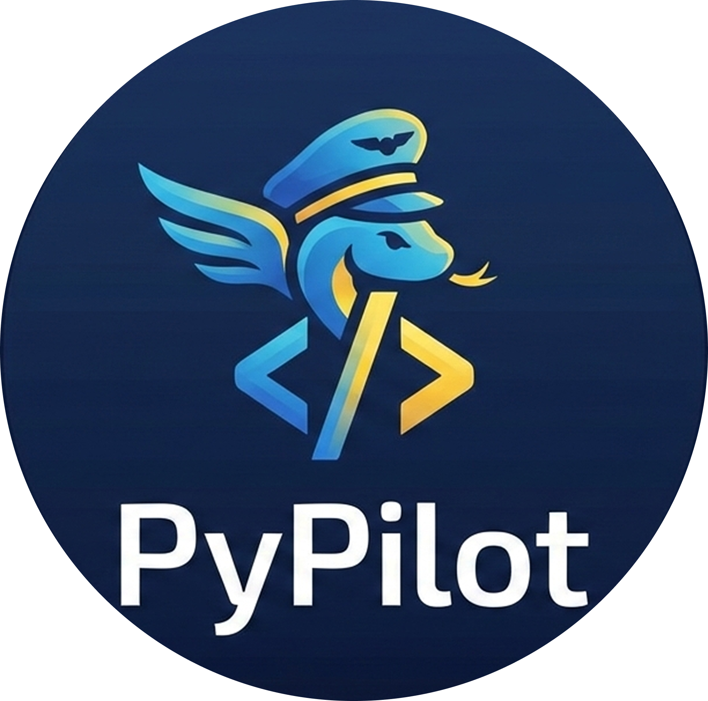

<div align="center">




AI coding assistant for VS Code.

[](https://langchain.com)
[](https://langchain-ai.github.io/langgraph/)
[](https://openai.com)
[](https://groq.com)
[](https://tavily.com)

</div>

## What It Does

- Chat with an AI agent that can read/write/edit files in your workspace
- Agent uses ReAct pattern (Reasoning + Acting) to solve coding tasks
- Visual diffs before accepting any changes
- Switch between OpenAI and Groq models
- All file operations happen locally (client-side) for security

## Architecture

```
┌─────────────────────────────────────────────────────────────────────────┐
│                          VS Code Extension                              │
│  ┌──────────────┐      ┌──────────────┐      ┌──────────────┐         │
│  │  💬 Chat UI  │ ───> │ 🔧 Tool      │ ───> │ 📊 Diff      │         │
│  │  (Webview)   │      │  Executor    │      │  Manager     │         │
│  └──────┬───────┘      └──────────────┘      └──────────────┘         │
│         │                                                               │
└─────────┼───────────────────────────────────────────────────────────────┘
          │ HTTP Request
          │ (User Message)
          ▼
┌─────────────────────────────────────────────────────────────────────────┐
│                         Backend Server (Python)                         │
│  ┌──────────────┐      ┌──────────────┐      ┌──────────────┐         │
│  │  🚀 FastAPI  │ ───> │ 🤖 LangGraph │ ───> │ 🛠️  Tools    │         │
│  │   Server     │      │  ReAct Agent │      │  (r/w/edit)  │         │
│  └──────────────┘      └──────┬───────┘      └──────────────┘         │
│                                │                                        │
│                                │ Tool Calls (JSON)                      │
└────────────────────────────────┼────────────────────────────────────────┘
                                 │
                    ┌────────────┴────────────┐
                    ▼                         ▼
          ┌──────────────────┐     ┌──────────────────┐
          │   OpenAI GPT-4   │     │   Groq Llama     │
          │   (LLM Provider) │     │   (LLM Provider) │
          └──────────────────┘     └──────────────────┘
```

**Flow:**
1. **User types request** in chat panel
2. **Extension sends** HTTP request to backend
3. **LangGraph agent** reasons using ReAct pattern (OpenAI/Groq)
4. **Agent returns** tool calls as JSON (doesn't execute)
5. **Extension executes** tools locally (Node.js fs)
6. **Diff Manager** shows changes with syntax highlighting
7. **User accepts/rejects** each change before saving

## Setup

### Prerequisites
- Python 3.11+ with `uv` ([install](https://github.com/astral-sh/uv))
- Node.js 18+
- VS Code 1.85+
- OpenAI or Groq API key

### 1. Backend

```bash
cd backend
uv sync
cp .env.example .env
# Add your OPENAI_API_KEY or GROQ_API_KEY to .env
uv run python src/app/main.py
```

Server: `http://localhost:8000`

### 2. Extension

```bash
cd vscode-extension
npm install
```

Press **F5** in VS Code → opens Extension Development Host

Open Command Palette (`Ctrl+Shift+P`) → **"Open PyPilot Assistant"**

## Usage

Try:
- "Create a Python script that reads a CSV file"
- "Add error handling to main.py"
- "List all Python files in src/"

The agent will execute operations and show diffs. Accept or reject each change.

## Tech Stack

- **Agent**: LangGraph + LangChain
- **Backend**: FastAPI + Python
- **Frontend**: TypeScript + VS Code API
- **Package Manager**: 
  - `uv` for backend
  - `npm` for VS Code extension

## Project Structure

```
pypilot/
├── backend/
│   ├── src/
│   │   ├── app/          # FastAPI routes & services
│   │   └── react_agent/  # LangGraph agent logic
│   └── pyproject.toml
└── vscode-extension/
    ├── src/
    │   ├── assistantPanel.ts  # Chat UI
    │   ├── toolExecutor.ts    # File operations
    │   └── diffManager.ts     # Visual diffs
    └── package.json
```

## Documentation

- [backend/README.md](backend/README.md) - Backend details
- [vscode-extension/README.md](vscode-extension/README.md) - Extension details

## Notes

- Built as a learning project after completing the [LangChain Academy's LangGraph course](https://academy.langchain.com/certificates/oiluhlnloe)
- State uses in-memory checkpointer (lost on restart)
- Always review diffs before accepting changes

